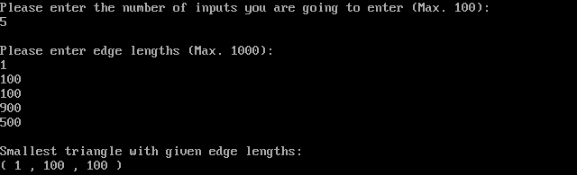

# Triangle Inequality
* Assembly program which determines is it possible to create a triangle or not with given inputs representing edge lengths by triangle inequality. If possible, prints the smallest triangle.

### What is Triangle Inequality?

* The triangle inequality states that the sum of the lengths of any two sides of a triangle is greater than the length of the remaining side.

* It follows from the fact that a straight line is the shortest path between two points. The inequality is strict if the triangle is non-degenerate (meaning it has a non-zero area).

(Information from brilliant.org)

### Screenshots

Linked and executed via DOSBox.
